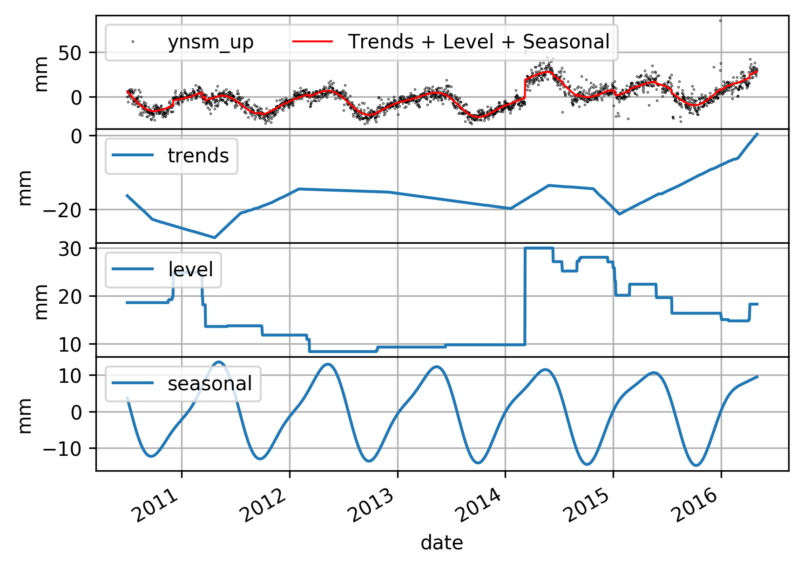
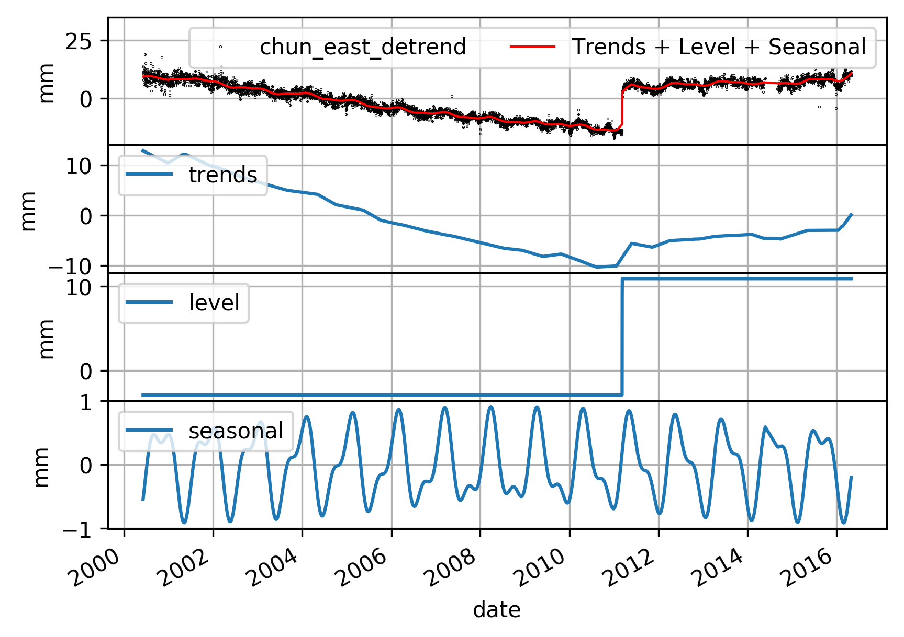

# L1tool: a tool for detection offsets and trend changepoints in GNSS time-series

L1tool is a Python package for detction offsets and trend changepoints in GNSS time-seres. It is an extensive model from L1 trend filtering and Total Variational regularization.

## Installation

L1tool is on PyPI, so you can use pip to install it:
```
# bash
$ pip install l1tool
```

Also you can download from github, can type:
```
# bash
python setup.py install
```

## Usage And Examples

### Usage

`l1tool` provides a command-line tool:
```
# bash
.\l1tool --file filename --lam 2000 --rho 80 --periods 365.25,186.725 --verbose  --solve cvxopt --out output_filename
```

- file: is input time-series file, the format is in "YYYY-mm-DD value". For detials, there are two examples file `ynsm_up.dat` and 'chun_east_detrend.dat' in Example directory.
- lam: Lambda parameter
- rho: Rho parameter
- periods: the seasonal periods of time-series, here 365.25 and 186.725 are annaul and semi-annual. Each period should be separate with a comma.
- verbose: display the solve information
- out: the output file, the estimated components, include raw, trends, level shifts and seasoanal (if input periods).

## Examples

There two examples provided in Examples directory.





